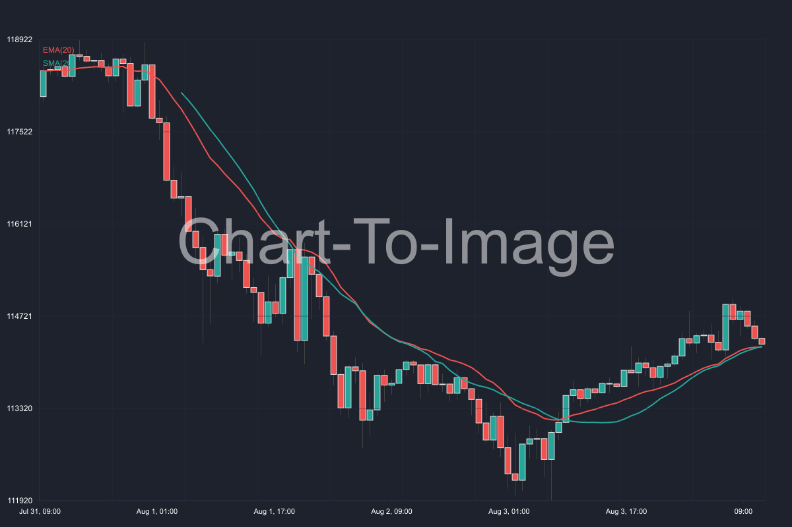
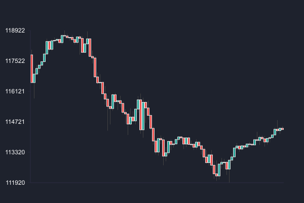
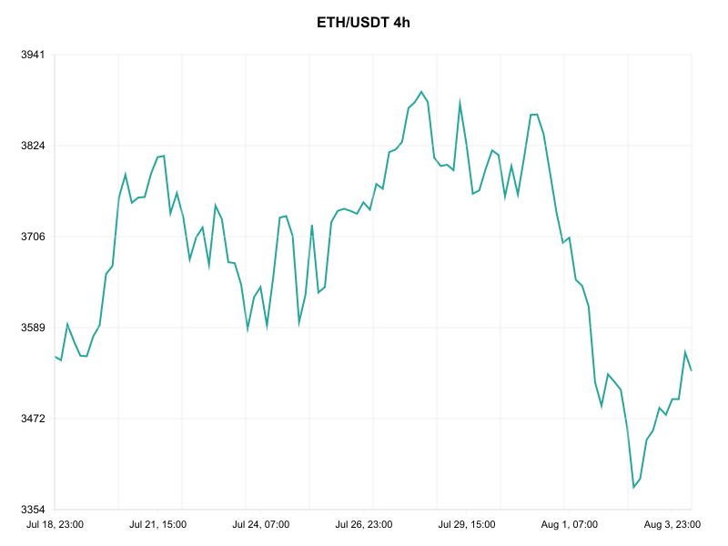
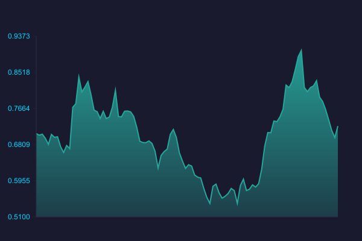
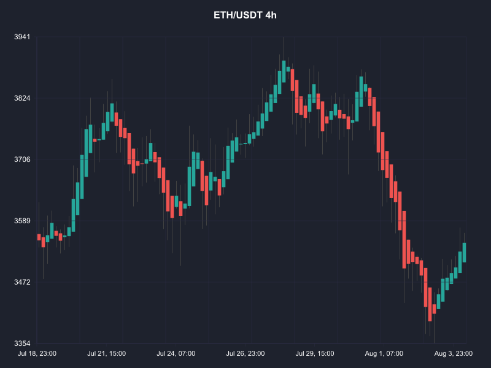
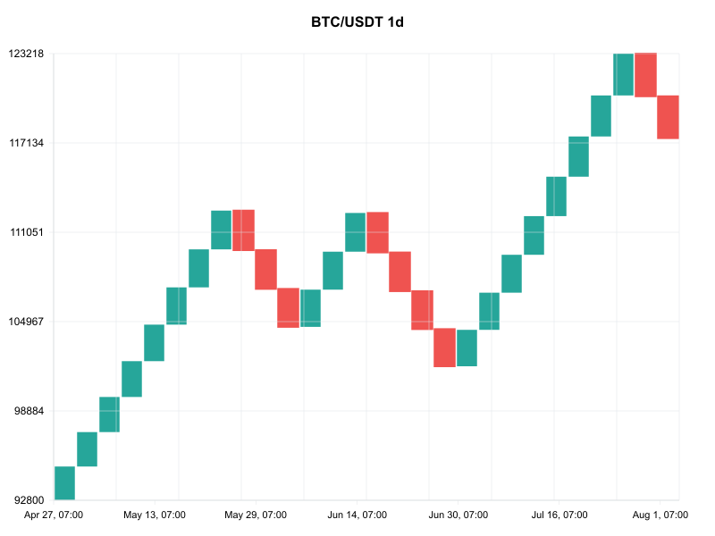
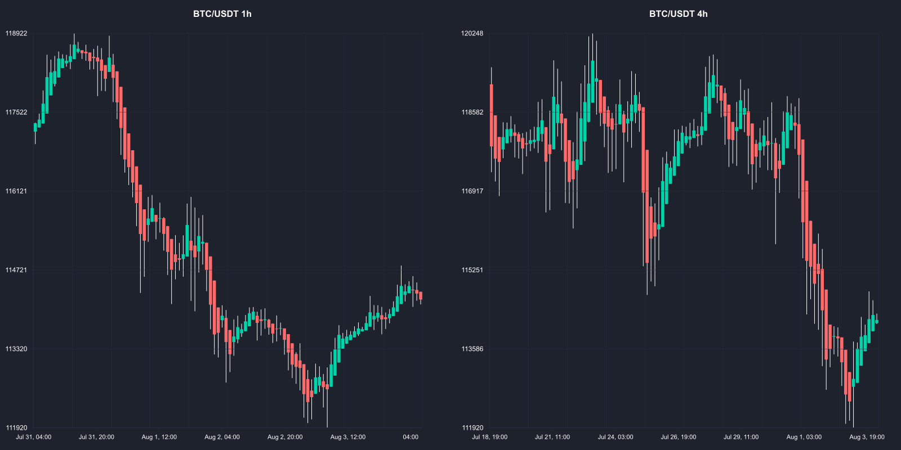

# 📊 Chart To Image

[](https://www.npmjs.com/package/@neabyte/chart-to-image)
[](https://www.npmjs.com/package/@neabyte/chart-to-image)
[](https://github.com/NeaByteLab/Chart-To-Image/blob/main/LICENSE)
[](https://www.typescriptlang.org/)
[](https://nodejs.org/)

Convert trading charts to images using [Node.js Canvas](https://github.com/Automattic/node-canvas), [lightweight-charts](https://github.com/tradingview/lightweight-charts), and [CCXT](https://github.com/ccxt/ccxt). A powerful Node.js library for generating high-quality trading chart images from market data.



## 📊 Chart Types Demo

| Candlestick | Line | Area |
|-------------|------|------|
|  |  |  |

| Heikin-Ashi | Renko |
|-------------|-------|
|  |  |

### 🔄 Comparison Charts




---

## Features

- 📊 **Real Market Data**: Fetch live data from multiple exchanges via [CCXT](https://github.com/ccxt/ccxt)
- 🎨 **High-Quality Charts**: Generate professional charts using [lightweight-charts](https://github.com/tradingview/lightweight-charts)
- 🖼️ **Multiple Formats**: Export to PNG and JPEG formats using [Node.js Canvas](https://github.com/Automattic/node-canvas)
- ⚡ **Fast & Lightweight**: Optimized for performance and minimal dependencies
- 🔧 **Flexible API**: Both programmatic API and CLI interface
- 📦 **Easy Integration**: Simple npm install and import
- 🎨 **Custom Bar Colors**: Customize bullish/bearish candle colors
- 📈 **Horizontal Levels**: Add support/resistance levels with labels
- 🌈 **Advanced Chart Types**: Candlestick, Line, Area, Heikin-Ashi, Renko, Line Break
- 🎯 **Custom Themes**: Light/Dark themes with custom colors
- 👁️ **Hide Elements**: Hide title, time axis, and grid
- 🎨 **Color Customization**: Hex, RGB, named colors, and gradients
- 📏 **Scaling Options**: Auto-scaling and manual scale factors
- 🔄 **Multiple Exchanges**: Binance, Kraken, Coinbase, and more
- 🔄 **Chart Comparison**: Side-by-side and grid layouts for multiple symbols
- ⏰ **Timeframe Comparison**: Same symbol across different timeframes
- 🎨 **Comparison Customization**: Custom colors and themes for comparisons

## 🛠️ Technologies Used

- **[Node.js Canvas](https://github.com/Automattic/node-canvas)**: High-performance 2D graphics rendering
- **[lightweight-charts](https://github.com/tradingview/lightweight-charts)**: Professional trading chart library
- **[CCXT](https://github.com/ccxt/ccxt)**: Unified cryptocurrency exchange API
- **TypeScript**: Type-safe development
- **ESLint**: Code quality and consistency

---

## 📦 Installation

```bash
npm install @neabyte/chart-to-image
```

## 🚀 Quick Start

### 💻 CLI Usage

```bash
# Basic chart generation
npx @neabyte/chart-to-image --symbol BTC/USDT --output chart.png

# Custom timeframe and dimensions
npx @neabyte/chart-to-image -s ETH/USDT -t 4h -o eth-chart.png -w 1200 -h 800

# With custom theme and colors
npx @neabyte/chart-to-image -s BTC/USDT -o chart.png --theme dark --background-color "#1a1a2e" --text-color "#00d4ff"

# Advanced chart types
npx @neabyte/chart-to-image -s ETH/USDT -o heikin-ashi.png --chart-type heikin-ashi
npx @neabyte/chart-to-image -s BTC/USDT -o renko.png --chart-type renko
npx @neabyte/chart-to-image -s BTC/USDT -o line-break.png --chart-type line-break

# Technical indicators
npx @neabyte/chart-to-image -s BTC/USDT -o vwap-chart.png --vwap
npx @neabyte/chart-to-image -s ETH/USDT -o ema-chart.png --ema
npx @neabyte/chart-to-image -s BTC/USDT -o sma-chart.png --sma
npx @neabyte/chart-to-image -s BTC/USDT -o indicators.png --vwap --ema --sma

# Chart comparison (side-by-side)
npx @neabyte/chart-to-image --compare "BTC/USDT,ETH/USDT" --output comparison.png

# Timeframe comparison (same symbol, different timeframes)
npx @neabyte/chart-to-image --compare "BTC/USDT,BTC/USDT" --timeframes "1h,4h" --output timeframe-comparison.png

# Grid comparison with custom colors
npx @neabyte/chart-to-image --compare "BTC/USDT,ETH/USDT" --layout grid --custom-colors "bullish=#00ff88,bearish=#ff4444" --output grid-comparison.png

# Comparison with indicators
npx @neabyte/chart-to-image --compare "BTC/USDT,ETH/USDT" --vwap --ema --output comparison-indicators.png

# Hide elements for clean charts
npx @neabyte/chart-to-image -s ADA/USDT -o clean.png --hide-title --hide-time-axis --hide-grid
```

---

### 🔧 Programmatic API

```typescript
import { quickChart, generateChartImage, fetchMarketData, ComparisonService } from '@neabyte/chart-to-image'

// Quick chart generation
const result = await quickChart('BTC/USDT', 'chart.png', {
  timeframe: '1h',
  width: 1200,
  height: 800,
  theme: 'dark'
})

// Advanced configuration
const config = {
  symbol: 'ETH/USDT',
  timeframe: '4h',
  exchange: 'binance',
  outputPath: 'eth-chart.png',
  width: 1000,
  height: 600,
  theme: 'light',
  chartType: 'heikin-ashi',
  backgroundColor: '#1a1a2e',
  textColor: '#00d4ff',
  customBarColors: {
    bullish: '#00ff88',
    bearish: '#ff4444',
    wick: '#ffffff',
    border: '#333333'
  },
  showTitle: false,
  showTimeAxis: false,
  showGrid: false
}

const result = await generateChartImage(config)

// Chart comparison
const comparisonResult = await ComparisonService.sideBySide(
  ['BTC/USDT', 'ETH/USDT'],
  'comparison.png'
)

// Timeframe comparison
const timeframeResult = await ComparisonService.timeframeComparison(
  'BTC/USDT',
  ['1h', '4h', '1d'],
  'timeframe-comparison.png'
)

// Grid comparison with custom colors
const gridResult = await ComparisonService.grid(
  ['BTC/USDT', 'ETH/USDT'],
  2,
  'grid-comparison.png',
  {
    customBarColors: {
      bullish: '#00ff88',
      bearish: '#ff4444'
    }
  }
)

// Chart with technical indicators
const indicatorResult = await generateChartImage({
  symbol: 'BTC/USDT',
  timeframe: '1h',
  outputPath: 'indicators.png',
  showVWAP: true,
  showEMA: true,
  emaPeriod: 20,
  showSMA: true,
  smaPeriod: 20
})

// Comparison with indicators
const comparisonWithIndicators = await ComparisonService.sideBySide(
  ['BTC/USDT', 'ETH/USDT'],
  'comparison-indicators.png',
  {
    showVWAP: true,
    showEMA: true,
    emaPeriod: 20,
    showSMA: true,
    smaPeriod: 20
  }
)
```

## ⚡ Advanced Features

### 📊 Chart Types

- **Candlestick**: Traditional OHLC candles
- **Line**: Simple line chart
- **Area**: Filled area chart
- **Heikin-Ashi**: Trend-smoothed candles
- **Renko**: Price-based block chart
- **Line Break**: Break high/low trend patterns

### 📈 Technical Indicators

- **VWAP**: Volume Weighted Average Price (institutional standard)
- **EMA**: Exponential Moving Average (configurable periods)
- **SMA**: Simple Moving Average (configurable periods)
- **Combined Analysis**: Use all indicators together for comprehensive analysis

### 🎨 Custom Colors

```bash
# Hex colors
--background-color "#1a1a2e" --text-color "#00d4ff"

# RGB colors
--background-color "rgb(25, 25, 112)" --text-color "rgb(255, 215, 0)"

# Named colors
--background-color "midnightblue" --text-color "gold"

# Gradients
--background-color "linear-gradient(135deg, #667eea 0%, #764ba2 100%)"
```

### 👁️ Hide Elements

```bash
# Hide title
--hide-title

# Hide time axis
--hide-time-axis

# Hide grid
--hide-grid

# Hide all elements
--hide-title --hide-time-axis --hide-grid
```

### 📏 Scaling Options

```bash
# Auto-scaling
--auto-scale

# Manual scaling
--scale-x 1.2 --scale-y 1.1

# Price limits
--min-scale 45000 --max-scale 50000
```

---

## 📋 CLI Reference

```bash
# Basic Options
--symbol, -s <symbol>       Trading symbol (e.g., BTC/USDT)
--timeframe, -t <tf>        Timeframe (1m, 5m, 15m, 30m, 1h, 4h, 1d, 1w)
--exchange, -e <ex>         Exchange (binance, coinbase, kraken, etc.)
--output, -o <path>         Output image path
--width, -w <px>            Chart width in pixels
--height, -h <px>           Chart height in pixels

# Chart Types
--chart-type <type>         Chart type (candlestick, line, area, heikin-ashi, renko, line-break)

# Themes & Colors
--theme <theme>             Theme (light, dark)
--background-color <color>  Background color (hex, rgb, name, gradient)
--text-color <color>        Text color (hex, rgb, name)

# Custom Bar Colors
--custom-colors <colors>    Custom colors (format: type=color,type=color)

# Horizontal Levels
--levels <levels>           Horizontal levels (format: value:color:style:label,value:color:style:label)

# Chart Comparison
--compare <symbols>         Compare multiple symbols (format: symbol1,symbol2)
--layout <type>             Layout type (side-by-side, grid)
--columns <number>          Number of columns for grid layout (max 2)
--timeframes <timeframes>   Compare timeframes (format: 1h,4h,1d)

# Technical Indicators
--vwap                      Show VWAP indicator
--ema                       Show EMA indicator (default: 20 period)
--sma                       Show SMA indicator (default: 20 period)

# Hide Elements
--hide-title                Hide chart title
--hide-time-axis            Hide time axis labels
--hide-grid                 Hide grid lines

# Scaling
--auto-scale                Enable auto-scaling
--scale-x <factor>          X-axis scale factor
--scale-y <factor>          Y-axis scale factor
--min-scale <price>         Minimum price scale
--max-scale <price>         Maximum price scale

# Data Options
--fetch                     Fetch market data only
--limit <number>            Number of candles to fetch
```

## 🏢 Supported Exchanges

- Binance
- Coinbase
- Kraken
- KuCoin
- OKX

## ⏰ Supported Timeframes

- 1m (1 minute)
- 5m (5 minutes)
- 15m (15 minutes)
- 30m (30 minutes)
- 1h (1 hour)
- 4h (4 hours)
- 1d (1 day)
- 1w (1 week)

## 🖼️ Output Formats

- **PNG**: High-quality raster format
- **JPEG**: Compressed raster format

## 📖 Full Documentation

For complete usage guide with detailed examples, see **[USAGE.md](USAGE.md)** 📚

---

## 🛠️ Development

### 📦 Installation

```bash
git clone https://github.com/NeaByteLab/Chart-To-Image.git
cd Chart-To-Image
npm install
```

### 🔨 Build

```bash
npm run build
```

### 🚀 Development Mode

```bash
npm run dev
```

### 🧪 Testing

```bash
npm test
```

### 🔍 Linting

```bash
npm run lint
npm run lint:fix
```

---

## 📁 Project Structure

```
src/
├── core/
│   ├── config.ts         # Chart configuration
│   └── renderer.ts       # Chart rendering engine
├── renderer/
│   ├── charts.ts         # Chart type renderers
│   ├── elements.ts       # Chart elements (axes, grid, etc.)
│   ├── index.ts          # Main renderer orchestrator
│   ├── types.ts          # Renderer types
│   └── utils.ts          # Renderer utilities
├── types/
│   └── types.ts          # TypeScript type definitions
├── utils/
│   ├── cli.ts            # CLI argument parsing
│   ├── exporter.ts       # Image export utilities
│   ├── provider.ts       # Market data fetching
│   └── utils.ts          # Chart data utilities
├── index.ts              # Main API exports
└── cli.ts                # Command line interface
```

## 🤝 Contributing

1. 🍴 Fork the repository
2. 🌿 Create a feature branch
3. ✏️ Make your changes
4. 🧪 Add tests if applicable
5. 📤 Submit a pull request

---

## 📄 License

MIT License - see [LICENSE](LICENSE) file for details.